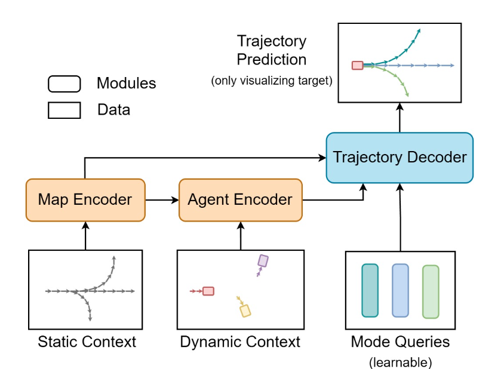
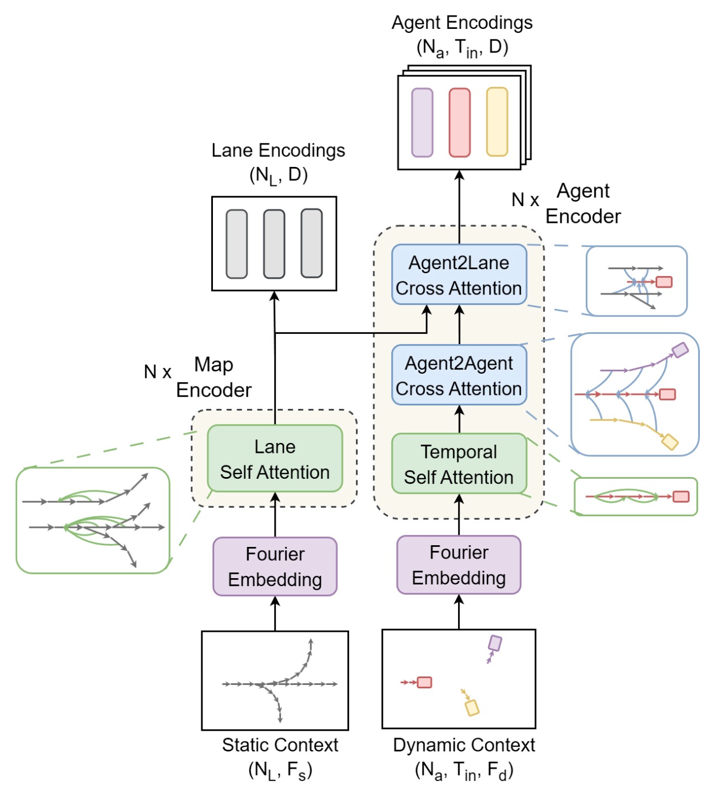
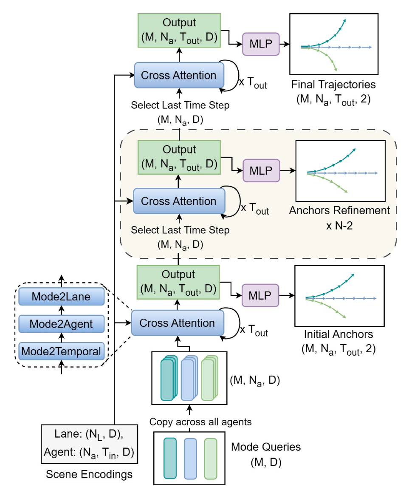

# LMFormer: Layered Mode-Refinement Transformer for Multi-Agent Motion Forecasting

## Overview

**LMFormer** is a state-of-the-art trajectory forecasting model for autonomous driving. Building on the CASPFormer family, it introduces a **layer-wise trajectory refinement mechanism**, a **multi-source mode query design**, and a novel **Winner-Takes-All (WTA)**-based loss to stabilize training.

By explicitly modeling **agent-map interactions** and **layered decoding over motion modes**, LMFormer achieves superior performance and interpretability on complex multi-agent datasets.

---

## Key Contributions

- 🧠 **Layered Mode-Refinement Decoder**: Refines predicted trajectories across stacked decoder layers with attention over agents, lanes, and time.
- 🧭 **Multi-Source Motion Mode Queries**: Incorporates temporal, spatial, and interaction cues into initial motion hypotheses.
- 🧩 **Decoupled Classification & Regression via WTA Loss**: Enables robust multi-modal learning without mode collapse.
- 📈 **State-of-the-Art Performance**: Competitive results on Argoverse 2, nuScenes, and DeepScenario datasets.

---

## Architecture

### High-Level Pipeline

The LMFormer architecture consists of:

- A **Map Encoder** that captures static lane context using Fourier embeddings and attention over lane graph segments.
- An **Agent Encoder** that models motion history and interactions through temporal and cross-agent attention.
- A **Decoder** that progressively refines mode-specific trajectory queries across multiple stacked layers.

---

### Encoder Modules

#### Map Encoder

- **Inputs**: Lane graph segments, direction vectors
- **Embedding**: Fourier encoding of segment lengths and angles
- **Processing**:
  - Self-attention over lane features
  - Integration of positional context (e.g., relative position embeddings)
- **Output**: Latent representations for each lane segment:
  $$\mathbf{L} \in \mathbb{R}^{B \times N_L \times D}$$

#### Agent Encoder

Each layer includes:

- **Temporal Self-Attention** to model agent motion dynamics
- **Agent2Agent Cross-Attention** to capture interaction effects
- **Agent2Lane Cross-Attention** to align agents with map context

Agent encodings are refined over $N$ stacked encoder layers.
Output shape:
$$\mathbf{A} \in \mathbb{R}^{B \times N_a \times T_{\text{in}} \times D}$$

---

### Decoder Modules

#### Mode Query Initialization

- A set of $M$ **learned motion mode queries** are broadcast to all agents.
- These queries are conditioned on agent history, social context, and map features.

#### Refinement Decoder (Layered)

Each decoder layer performs:

- **Mode-to-Temporal Attention**: Focuses mode queries on an agent's motion history
- **Mode-to-Agent Attention**: Enables social modeling across agents
- **Mode-to-Lane Attention**: Aligns modes with static map structure

Each layer outputs refined trajectory anchors. These are decoded into future waypoints.

> Layer-wise outputs are supervised during training to encourage progressive refinement.

---

## Output Structure

For each agent $i$, LMFormer produces $M$ trajectories:

- Means: $\mu^m_t \in \mathbb{R}^2$ (x, y at time $t$)
- Variances: $b^m_t \in \mathbb{R}^2$
- Mixture weights: $\pi_m \in [0, 1]$, with $\sum_m \pi_m = 1$

These represent a **mixture of Laplace distributions** over future positions.

---

## Loss Formulation

### 1. Regression Loss: Winner-Takes-All

Only the **closest** mode $m^*$ to the GT is optimized:

$$
\mathcal{L}_{\text{reg}} = -\sum_{t=1}^{T} \log \mathbb{L}(Y_t \mid \mu^*_{t}, b^*_{t})
$$

### 2. Classification Loss: Mixture Likelihood

Encourages high confidence in the best mode:

$$
\mathcal{L}_{\text{cls}} = -\log \left( \sum_{m=1}^M \pi_m \prod_{t=1}^T \mathbb{L}(Y_t \mid \mu^m_{t}, b^m_{t}) \right)
$$

### 3. Final Loss

To encourage progressive refinement, regression losses are added for all decoder layers $n \in [1, N]$:

$$
\mathcal{L}_{\text{total}} = \lambda \cdot \mathcal{L}_{\text{cls}} + \sum_{n=1}^N \mathcal{L}^{(n)}_{\text{reg}}
$$

---

## Training & Implementation Details

| Parameter        | Value                       |
|------------------|-----------------------------|
| Dataset          | nuScenes (main), AV2, DeepScenario |
| Encoder Layers   | 3                           |
| Decoder Layers   | 3–6                         |
| Motion Modes     | $M=5$                       |
| Optimizer        | AdamW                       |
| Batch Size       | ??                         |
| Epochs           | ??                       |
| Learning Rate    | ?? |
| Timestep Config  | $T_{\text{in}}=4$, $T_{\text{out}}=12$ |
| Loss Distribution| Laplace (with learned scale) |

---

## Implementation Tips

- 🧠 **Mode queries** should be initialized via clustering agent motion patterns or learned directly.
- ⏱️ **Agent encodings** can be pooled over time (e.g., last timestep) for temporal queries.
- 🔁 **Layer-wise supervision** stabilizes learning and ensures early trajectory hypotheses are usable.
- 🗺️ **Relative position encodings** across attention layers help model structured interactions.
- 🧩 **Deformable or sparse attention** may reduce compute overhead if scaling to larger scenes.

---

## Performance & Evaluation

| Metric        | CASPFormer | LMFormer (ours) |
|---------------|------------|-----------------|
| minADE@5      | ✓ baseline | ↓ improved      |
| miss rate@5   | ✓ baseline | ↓ improved      |
| off-road rate | ✓ baseline | ↓ improved      |

- LMFormer shows improved **long-horizon accuracy** and **better spatial alignment**.
- Layer-wise refinement allows early hypotheses to be useful even when later stages fail.
- Qualitative results confirm **interpretability of attention weights** (e.g., focus on relevant lanes).

---

## Comparison to Related Models

| Model       | Decoder Style       | Map Structure | Layer-wise Refinement | WTA Loss | Modal Output |
|-------------|---------------------|---------------|------------------------|----------|--------------|
| **LMFormer**| Transformer (stacked) | ✔️ Lane graph  | ✔️ Yes                  | ✔️ Yes    | ✔️ Yes (M=5) |
| CASPFormer  | Transformer (1 pass) | ✖️             | ✖️ No                   | ✔️ Yes    | ✔️ Yes       |
| MTR         | Feedforward          | ✖️             | ✖️ No                   | ✖️ (VAE)  | ✔️ Yes       |
| UniTraj     | Unified backbone     | ✖️             | ✖️ No                   | ✖️        | ✔️ Yes       |

---

## Summary

**LMFormer** is a query-centric, lane-aware transformer that introduces *layer-wise mode refinement* and *structural context modeling* for multi-agent forecasting. Its modular encoder-decoder pipeline, WTA loss design, and iterative refinement make it highly performant, interpretable, and extensible for real-world autonomous driving.

> LMFormer stands as a compelling example of interpretable, multimodal prediction grounded in spatial structure and agent-map interaction.
